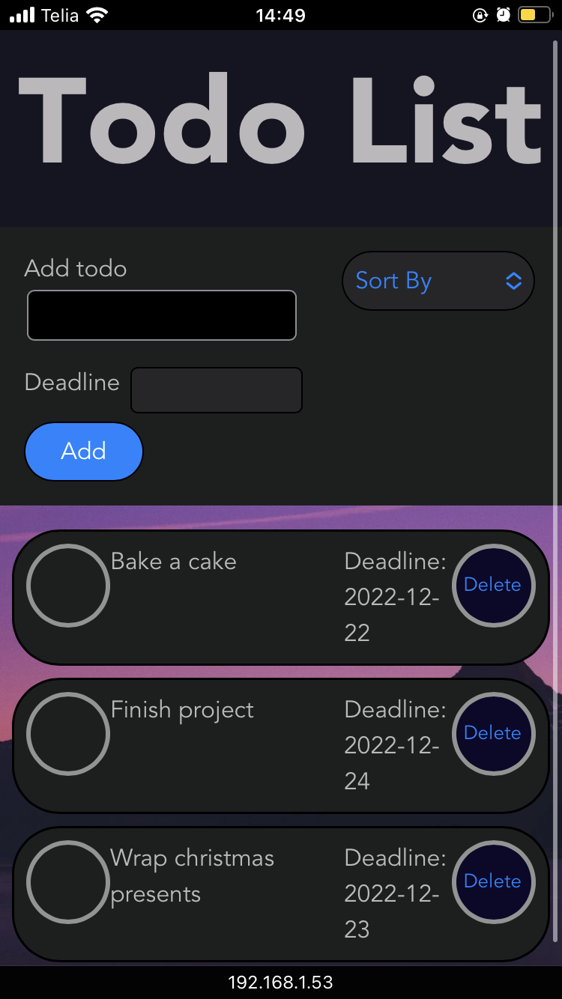
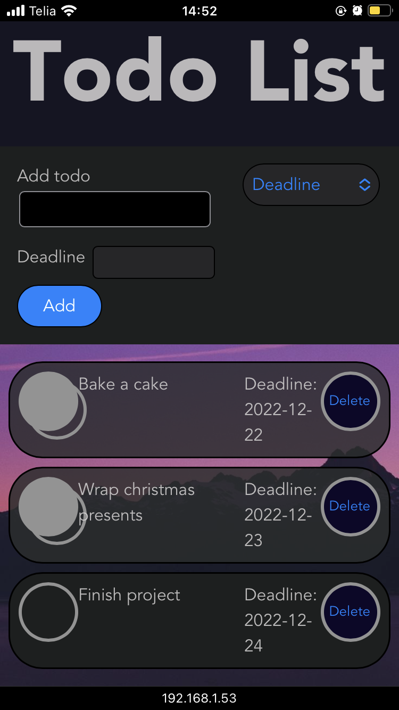
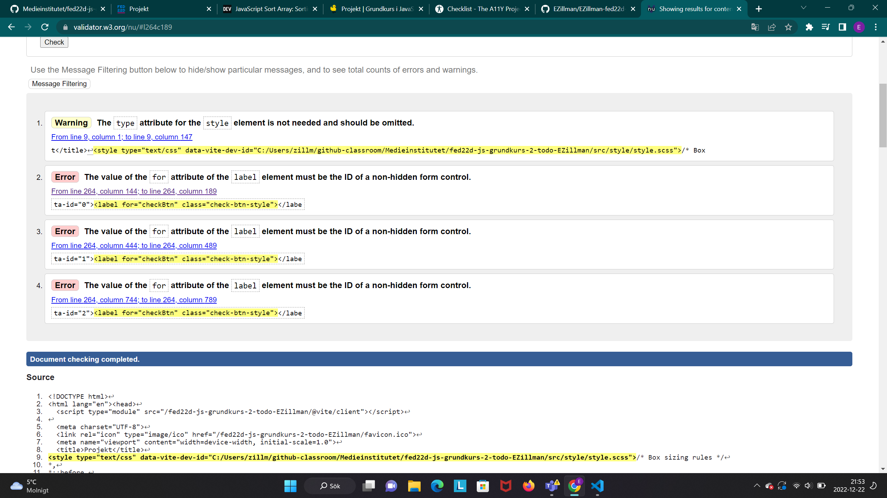
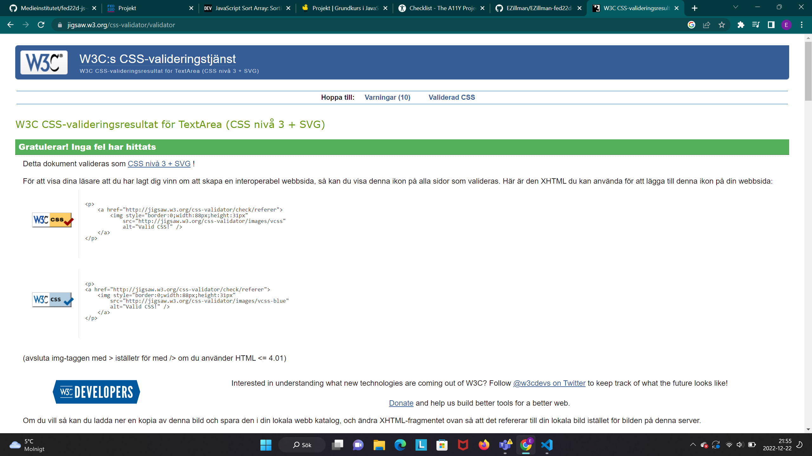

# A simple todo list

To learn and practice the basics of JavaScript I have made a todo list. To add tasks to the todo list you have to write something in the input field, choose a deadline and then click on the "add" button. You can check your task when it's completed, and then delete it if you want to. You can also sort your tasks by deadline, alphabetical order and by the date you added your tasks.

## Here are some pictures to show what it looks like

### Desktop

### Mobile

 

## Here is my lighthouse check and validation

### Lighthouse

### Validation

I made a custom checkbox with css that is connected to the original checkbox, that is why the original checkbox is hidden. I have made sure that the checkbox still is accessible by the keyboard and by screenreaders, that is why the errors are no problem in this case.  
